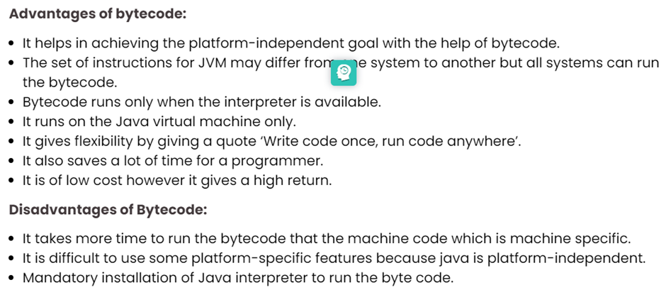

# 1. * Ways to create a new type/class in java (class, interface, …)
     class MyClass {
     // field, constructor, and
     // method declarations
     }
 It’s simple declaration, without information about 
* superclass, interface and access level. But we can use 
* more difficult method class declaration. Example :

Public class Cat extends Animal implements Run {
// field, constructor, and
// method declarations
}

Public – access level (protected, default, privat)
Animal – superclass (cat inherit from this class)
Run – interface (implements all methods from interface Run).

In general, class declarations can include these components, in order:
Modifiers such as public, private, and a number of others that you will 
encounter later. (However, note that the private modifier can only be applied
to Nested Classes.)
The class name, with the initial letter capitalized by convention.
The name of the class's parent (superclass), if any, preceded by the keyword 
extends. A class can only extend (subclass) one parent.
A comma-separated list of interfaces implemented by the class, if any, preceded 
by the keyword implements. A class can implement more than one interface.
The class body, surrounded by braces, {}.
There are four different ways to create objects in Java with:

A. Using a new keyword is the most common way to create an object in Java applications. Almost 99% of objects are created this way.

MyObject myobject = new MyObject();
c. Using Class.forName()
If we know the name of the class and if it has a public default constructor, we can create an object this way.

Object MyObject = (Tmyobject) Class.forName("sun in.rnd.MyObject").newInstance();
C. Using clone()
A clone() can be used to create a copy of an existing object.

MyObject anotherObject = new MyObject();
MyObject myobject = (MyObject) another object.clone();
D. Deserialization of the object Usage
Deserialization of objects is nothing more than the creation of an object from its serialized form.

ObjectInputStream inStream = new ObjectInputStream(input stream);
MyObject = (MyObject) inStream.readObject() object;

#  2. *‘Inner’ classes: classification, differences, best practice.*
   Nested classes are divided into two categories: non-static and static. Non-static nested classes are called inner classes. Nested classes that are declared static are called static nested classes.

Non-static nested classes (inner classes) have access to other members of the enclosing class, even if they are declared private.

As with instance methods and variables, an inner class is associated with an instance of its enclosing class and has direct access to that object's methods and fields. Also, because an inner class is associated with an instance, it cannot define any static members itself.

An instance of InnerClass can exist only within an instance of OuterClass and has direct access to the methods and fields of its enclosing instance.

An instance of InnerClass can exist only within an instance of OuterClass and has direct access to the methods and fields of its enclosing instance.
A nested class is a member of the class that includes it. Non-static nested classes (inner classes) have access to other members of the enclosing class,
even if they are declared private. Static nested classes do not have access to other members of the enclosing class. Being a member of another class, any nested class can be declared private, package private, protected or public.
To instantiate an inner class, you must first instantiate the outer class. Then, create the inner object within the outer object with this syntax:
OuterClass outerObject = new OuterClass();
OuterClass.InnerClass innerObject = outerObject.new InnerClass();
There are two special kinds of inner classes: local classes and anonymous classes.

Inner classes – exist only inside outer class. And we have  two additional options inner classes :
-local classes (has name, but exist only inside method body).
-anonymous classes (unnamed, exist only inside method body).

#  4. *Naming convention for classes, best practice.*
Class names should be nouns, in mixed case with the first letter of each 
internal word capitalized. Try to keep your class names simple and descriptive.
Use whole words-avoid acronyms and abbreviations (unless the abbreviation is 
much more widely used than the long form, such as URL or HTML).
*https://www.oracle.com/java/technologies/javase/codeconventions-namingconventions.html*

# 5. *Keywords to be used for creating new classes/types.*
   super - Refers to superclass (parent) objects
   abstract - A non-access modifier. Used for classes and methods: An abstract class cannot be used to create objects (to access it, it must be inherited from another class). An abstract method can only be used in an abstract class, and it does not have a body. The body is provided by the subclass (inherited from)
   boolean, char, int, String, double, long.. – create new field.
   Public, private, protected, default – access modifier
   Class – create new class, defines a class
   Static – a non-access modifier used for methods and attributes. Static methods/attributes can be accessed without creating an object of a class.
   new - creates new objects
6. **
#  7. *Byte code in java.*
   Bytecode in Java is an intermediate machine-independent code. It is a set of 
   instructions for Java Virtual Machine and it acts pretty similar to the assembler in C++. In general, bytecode is a code that lies between low-level and high-level language. The bytecode is not processed by the processor. It is processed by the Java Virtual Machine (JVM). The job of the JVM is to call all the required resources to compile the Java program and make the bytecode independent. It is the biggest reason why java is known as a platform-independent language. The intermediate code can run on any of the platforms such as Windows, macOS, and Linux.
   Program: Program is a .java file. It consists of the code that you have written.
   Compiler: Compiler complies the .java file and generate .class file.
   Bytecode: The .class file contains the bytecode. Now, we can run the .class file in any of the other platforms.
   JVM: JVM runs the bytecode without considering a processor.
   Machine Code: Now, the machine generates its own machine code in which the byte code is running. That means, its own machine-dependent code to run the .java file.
   The only essential requirement for running the bytecode is the installation of basic java in any platform.
 
# 8. *Structure of a file with extension ‘.class’.*
   Structure of a file with extension ‘.class’.
   The general form of a file containing Java source code may be as follows:
- single package statement (optional);
- any number of import statements (optional);
- single public class (optional);
- any number of packet-level access classes (optional);
- interface descriptions (optional);
- comments (optional).
  Classes may be missing in the file. At the same time, no file with the .class extension will be created as a result of compilation.

И.Н. Блинов, В. С. Романчик, Java. Методы программирования, стр. 120.

*https://docs.oracle.com/javase/specs/jvms/se7/html/jvms-4.html*

