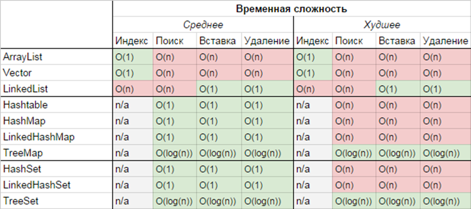

# 1. *Why static and non static blocks were introduced in Java?*
A static block is required for :
- Performing some initial actions before using the class (For example, calculating any static values, collecting system data, connecting to a database or remote server.);
- Initializing static variables.

Non-static block is required for:
Used if:
During initialization, it is necessary to handle the exception being checked.
It is not convenient to calculate the value of a field using an expression (for example, this requires a specially created class or method that you do not want to create just for these purposes).
It is necessary to initialize the anonymous class field (it is impossible to declare a constructor in an anonymous class).
# 2. * Life cycle of static and non static blocks.*
A static block is executed once in the life cycle of any program, and there is no other way to call it.
Non-static blocks run every time when an object of your class is being created.
# 3. *Static and non static blocks and inheritance: rules of initialization static and non static blocks between parent and children.*
When loading the Child class, the initialization order will be as follows:
1. Static fields of the Parent class.
2. Static initialization block of the Parent class.
3. Static fields of the Child class.
4. Static initialization block of the Child class.
5. Non-static fields of the Parent class.
6. Not a static initialization block of the Parent class.
7. Constructor of the Parent class.
8. Not static fields of the Child class.
9. Not a static initialization block of the Child class.
10. Constructor of the Child class.

*https://javarush.ru/groups/posts/3284-razbor-voprosov-i-otvetov-s-sobesedovaniy-na-java-razrabotchika-chastjh-4*

# 4-5. *Usage of static blocks and best practice.*
# Non static blocks: usage, best practice.*
Logical blocks can be used when describing a class. A logical block is a code enclosed in curly brackets and does not belong to any method of the current class, for example: { /* code */ } static { /* code */ } Logical blocks are most often used as initializers of fields, but may contain method calls and accesses to fields of the current class. When creating a class object, they are called sequentially, in the order of placement, together with the initialization of fields as a simple sequence of operators, and only after executing the last block will the class constructor be called. Operations with class fields inside a logical block before explicitly declaring this field are possible only when using the this reference, which is a reference to the current object. A logical block can be declared with the static specifier. In this case, it is called only once in the application lifecycle when creating an object or when accessing a static method (field) of this class. In practice, static logic blocks can be used to check and initialize the basic parameters necessary for the operation of an application or class. Non-static logic blocks can be used to check and initialize the parameters of a specific object and to reduce the amount of code if the same code is present in each constructor.

In the second line of the output, the id field will get the default value, since the memory for it was allocated when the object was created, and the value has not yet been initialized. The third line displays the value of the id field equal to 7, since after initializing the class attribute, a logical block was called that received its value. Logical blocks are not inherited.

