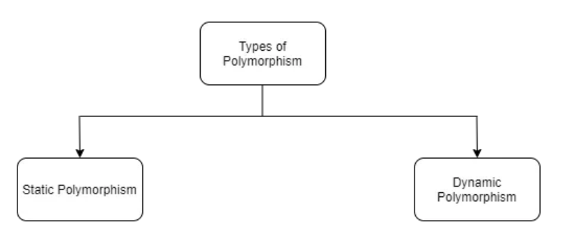

# 1. Description of the essence of the idea. #
Polymorphism is the property of a system to use objects with the same interface without information about the type and internal structure of the object.

The advantage of polymorphism is that it helps to reduce the complexity of programs by allowing the use of the same interface to specify a single set of actions. The choice of a specific action, depending on the situation, is assigned to the compiler of the programming language. Hence, the key feature of polymorphism is the use of an object of a derived class, instead of a base object (descendants can change the parent behavior, even if they are accessed by a reference of the parent type).

# 2.      What are the types of it?

Static polymorphism - compile-time polymorphism (uses method overloading)
Dynamic polymorphism - Runtime polymorphism (uses method redefinition)

# 3.      Implementation and support of ‘Polymorphism’ in Java?
