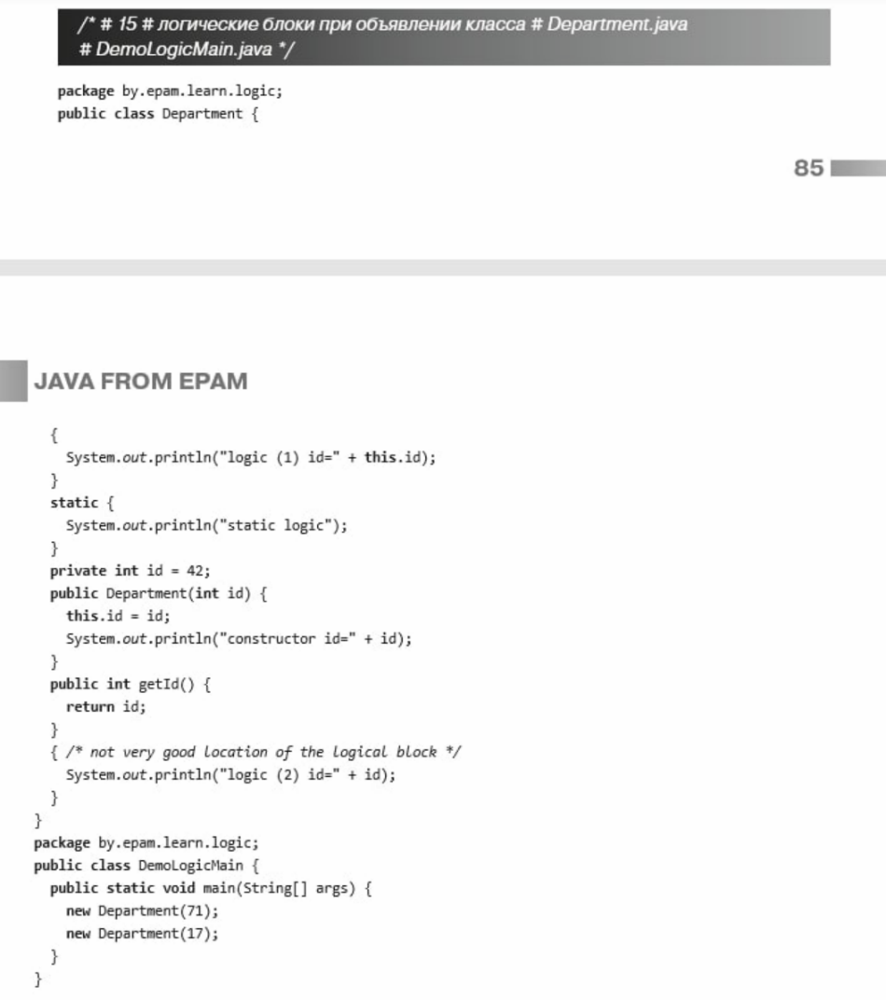

## 1.Give an informal definition of a container.
Answer. A container is any collection of elements that is a single entity organized in a certain way.
Containers can be classified according to 3 (related) characteristics:
- how to access elements,
- method of storage (arrangement) of elements,
- a way of iteration (bypass) of elements.
## 2.What is the container in java other than collections?
## Give it a definition.
Answer. An array is a container that contains a fixed number of consecutive elements of the same type in memory.
The length of an array is set when it is created and cannot be changed.
## 3.What are the benefits of using Collections Framework
Answer. The Collections Framework provides the following benefits:
1. Reduces programming costs. By providing useful data structures and algorithms, the Collections Framework helps you focus on the important parts of your program. By facilitating interoperability between unrelated APIs, the Collections Framework frees you from writing adapter objects or conversion code to connect the API.
2. Increases program speed and quality: Provides high performance, high quality implementations of useful data structures and algorithms. The different implementations of each interface are interchangeable, so programs can be easily customized by switching set implementations. Since you don't have to create your own data structures, you have more time to improve the quality and performance of your programs.
3. Provides interoperability between unrelated APIs: Collection interfaces are common interfaces that APIs use to communicate collections.
4. Reduces the effort to learn and use new APIs: Many APIs naturally accept collections as input and provide them as output. In the past, each such API had a small sub-API dedicated to managing its collections. There was little consistency between these additional collections APIs, so you had to learn each one from scratch, and it was easy to make mistakes when using them. With the advent of standard collection interfaces, the problem disappeared.
5. Reduces effort to develop new APIs: This is the flip side of the previous benefit. Designers and developers don't have to reinvent the wheel every time they create a collection-based API; instead, they can use the standard collection interfaces.
6. Supports software reuse. New data structures that conform to standard collection interfaces are inherently reusable. The same goes for new algorithms that operate on objects that implement those interfaces.
## 4.Is the following collection reference declaration an antipattern?
    Collection collection;
## If so, what is the name of the antipattern and fix the link declaration.
Answer. Yes.
It is called raw type.
Collection<Object> collection;
Collection<?> collection;
Collection<Object> is a parameterized type that can contain objects of any type,
Collection<?> is a wildcard type that can only contain objects of some unknown type.
Both options are safe and provide type compatibility control both at compile time and at runtime.
## 5. What are the negative consequences of using raw types?
## Give an example.
Answer. Using raw types may result in a runtime error.

    Listdata = new ArrayList();
    data.add("100");
    Integer num = (Integer) data.get(0); //ClassCastException
## 6. Why are raw types allowed with collections?
Answer. Raw types are left in the language for backward compatibility and interoperability with code written before the advent of generic programming tools.
## 7. Which interface implementation allows collections to be used in a for-each construct?
## What method of this interface provides this capability?

    public interface Iterable<T>
    Iterator<T> iterator()
## 8. When should you explicitly use an iterator instead of for-each?

1. When you need to remove the element(s) of the collection. The for-each construct hides the iterator, so the remove() method cannot be used. Therefore, the for-each construct cannot be used for filtering.
2. When it is required to go through several collections in parallel.
## 9. What is the main property of all implementations of the Set interface, i.e. what unites them regardless of implementation?
Answer.
Set, i.e. each implementation of the Set interface contains only unique elements (cannot be repeated).
## 10. Can a set contain a null element?
Answer. Yes, and only one.
Some implementations, such as EnumSet. do not allow null elements
## 11. Is there a sequence relation (previous, current, next element) in the set?
## If not, does the set have an iterator?
Answer.
There is no following relationship.
Yes, there is, because Set is a subinterface of Collection, which, in turn, is a subinterface of Itrerable.
## 12. How to get an element of a set by index?
Answer. 
No way.
If there is a need for such an operation, then another data structure must be used.
## 13. How is the add() method implemented in the set?
Answer.
   Adds the specified element to the set if it does not already exist. More formally, adds the specified element e to the set if there is no element e2 in this set such that (e == null? E2 == null: e.equals(e2)). If the set already contains an element, the call leaves the set unchanged and returns false. Combined with the restriction on constructors, this ensures that sets will never contain duplicate elements.
## 14. What methods must be overridden in the class that parameterizes the set to ensure that the TreeSet implementation works correctly?
The TreeSet class establishes a requirement for the implementation of the Comparable interface by a class of objects contained in the set - the compareTo method or for providing a comparator for comparing objects of this class.
A common programmer mistake is that when overriding the equals() method, the correspondence between the equals() and compareTo() methods is not preserved, which is an informal requirement to avoid storing duplicates in a Set (SortedSet, TreeSet).
## 15. What is the relevance of an external comparator?
Answer.
An external comparator allows you to sort objects
1. in an order other than natural (or internal, when the Comparable interface is implemented).
2. the natural (internal) sort order of which is not specified.
## 16. What is the main property of all implementations of the List interface, i.e. what unites them regardless of implementation?
Answer. The main property is the presence of a sequence relation (previous, current, next element). Each element has an (implicit, virtual) number (index) by which the element can be accessed.
## 17. What mathematical entity does the Deque interface model?
Answer. There is no mathematical entity that is being modeled.
The Deque interface defines a "deque" queue and, accordingly, methods for accessing the initial and last elements of this queue.
## 18. What is the main property of all implementations of the Deque interface, i.e. what unites them regardless of implementation?
Answer. A deque is a linear set of elements that supports the insertion and removal of elements at both endpoints. The Deque interface is a richer abstract data type than Queue because it implements both stacks and queues at the same time.
## 19. Is it true that Queue always processes elements in FIFO order?
Answer. No, not true. Queues usually, but not necessarily, order items in FIFO (first in, first out) order. Exceptions include priority queues, which order elements according to a provided comparator, or natural ordering of elements, and LIFO queues (or stacks), which order elements in LIFO ("last in, first out").
## 20. Why is there a poll method in the Queue interface when there is remove?
Answer. In some situations, the queue is expected to be empty, and in those cases, it makes sense to have a method that does not throw an exception. In other situations it's an exception that the queue is empty and the exception is appropriate.
Throwing exceptions has a performance cost, and if you expect the queue to be empty from time to time, you don't need to treat queue-empty-logic as trapping the exception - it's both expensive and hard to read.
Otherwise, when you don't expect the queue to be empty, that's a sign of a programming bug or some other exception that's there, and you don't want to write horrible error condition checking code (e.g. checking for null), because in in this case it will be less readable than catching the exception (which can be done in a different scope).
## 21.What is the main property of all implementations of the Map interface, i.e. what unites them regardless of implementation?
Answer. Any Map implementation cannot contain two identical keys.
## 22. Which interface represents a multimap in the Collections Framework?
Answer. A multimap is similar to a map, but can map each key to multiple values. The Java Collections Framework does not include an interface for multimaps because they are not used as often. As an alternative to a multimap, a Map is used whose values are List instances.
## 23. What influences the choice of implementation?
Answer. In most cases, the choice of implementation only affects performance.
In some cases, the implementation adds or changes the way elements are handled.
## 24. When is it appropriate to use a TreeSet implementation instead of a HashSet?
Answer. In the case when you need to use operations in the SortedSet interface or if you need a collection ordered in a certain way.
## 25. Describe unordered implementations of Map.
Answer.
Hashtable is an implementation of a data structure such as a hash table. It does not allow null as a value or key. This collection was implemented earlier than the Java Collection Framework, but was later included in it. Like other collections from Java 1.0, Hashtable is synchronized (almost all methods are marked as synchronized). Because of this feature, it has significant performance issues and, starting with Java 1.2, it is recommended in most cases to use other implementations of the Map interface due to their lack of synchronization.
HashMap - Collection is an alternative to Hashtable. The two main differences from Hashtable are that HashMap is not synchronized and HashMap allows null as both key and value. Just like a Hashtable, this collection is not ordered: the order in which elements are stored depends on the hash function. Adding an element is done in constant O(1) time, but the time it takes to remove, get, depends on the distribution of the hash function. Ideally, it is constant, but can be linear O(n).
WeakHashMap is a hash table implementation that is organized using weak references. In other words, the Garbage Collector will automatically remove an element from the collection on the next garbage collection if the element's key is not hard-referenced.
## 26. Describe ordered implementations of Map.
Answer.
LinkedHashMap is an ordered hash table implementation. Here, unlike HashMap, the iteration order is equal to the order of adding elements. This feature is achieved thanks to bidirectional links between elements (similar to LinkedList). But this advantage also comes with the downside of increasing the amount of memory that the collection will take up. More information is provided in this article.
TreeMap is an implementation of Map based on red-black trees. Like LinkedHashMap is ordered. By default, the collection is sorted by the keys using the "natural ordering" principle, but this behavior can be customized for a specific task using the Comparator object, which is specified as a parameter when the TreeMap object is created.
## 27.What is the difference between ArrayList and LinkedList?
Answer. In short, the answer to this question boils down to the following: ArrayList is a sequence implemented on the basis of an array, and LinkedList is a sequence implemented on the basis of a classic linked list based on objects with links between them.
The advantages of ArrayList: in the possibility of accessing an arbitrary element by index in constant time (since it is an array), the minimum overhead when storing such a list, insertion at the end of the list, on average, is also performed in constant time. On average, because the array has a certain initial size n (in the code this is the capacity parameter), by default n = 10, when writing n + 1 elements, a new array of size (n * 3) / 2 + 1 will be created, it will contain all elements from the old array + the new element being added are placed. As a result, we get that when adding an element if it is necessary to expand the array, the time of adding will be much longer than when writing an element to a ready-made empty cell. However, on average, the time it takes to insert an element at the end of a list is constant. Removing the last element takes constant time. The disadvantages of ArrayList appear when inserting / removing an element in the middle of the list - this calls for overwriting all elements located "to the right" in the list one position to the left, in addition, when removing elements, the size of the array does not decrease, until the trimToSize () method is explicitly called.
LinkedList, on the contrary, can perform insertion / deletion of elements in the list in constant time (namely, insertion and deletion, searching for the position of insertion and deletion is not included here). An arbitrary element is accessed in linear time (but the first and last elements of a list are always accessed in constant time - references to the first and last are permanently stored, so adding an element to the end of the list does not mean that you have to iterate through the entire list in search of the last one element). In general, LinkedList in absolute terms loses to ArrayList both in terms of memory consumption and in terms of speed of operations. LinkedList is preferably used when there is active work (insertion/deletion) with the middle of the list or in cases where a guaranteed time to add an element to the list is needed.
## 27. What is the computational complexity of an operation (algorithm)?
Answer.
1. General case
   The computational complexity of an operation is a function of the amount of work that is performed by some algorithm on the size of the input data.
2. The most common case
   Instead of computational complexity, they operate with the concept of time complexity, which is estimated for the worst case, i.e. upper estimate of the speed of the operation.
   The time complexity of an operation is a function of the execution time of the operation on the size of the input data, equal to the maximum number of elementary operations performed by the algorithm to solve a task instance of the specified size.

## 28. What is the difference between Comparable and Comparator interfaces?
Answer. In Java, all collections that support automatic sorting use comparison methods to properly sort the elements. As an example of such classes, we can point to TreeSet, TreeMap, etc.
In order to sort elements, a class must implement the Comparator or Comparable interfaces. This is why wrapper classes like Integer, Double, and String implement the Comparable interface.
The Comparable interface helps keep the sorting natural, while the Comparator allows you to sort elements according to different custom patterns. The comparator instance is usually passed to the collection's constructor if the collection supports it. It should be noted that the Comparable interface can be implemented exactly by the collection elements or Map keys, while the Comparator is implemented by a separate object (this is convenient, since you can prepare several implementations for different sorting rules without changing the code of the collection elements / Map keys).
## 29. What is the difference between Iterator and ListIterator?
Answer.
1) Iterator can be used to iterate over Set, List and Map elements. In contrast, ListIterator can only be used to iterate over the elements of a List collection.
2) Iterator allows you to iterate over elements in only one direction, using the next () method. Whereas the ListIterator allows you to iterate over the list in both directions, using the next() and previous() methods.
3) With the ListIterator, you can modify the list by adding/removing elements using the add() and remove() methods. Iterator does not support this functionality
## 30. Why doesn't the Iterator class have a method to get the next element without moving the cursor?
Answer. An iterator is similar to a pointer in its basic operations: it points to a single element of a collection of objects (provides access to the element) and contains functions for moving to another element in the list (next or previous). A container that implements support for iterators must provide the first element of the list, as well as the ability to check whether all elements of the container have been iterated (if the iterator is finite). Thus, without a cursor, it will simply be impossible to implement error-free movement through the collection.
## 31.What are high-performance Set implementations for enumerated types?
Answer. EnumSet is a specialized Set implementation for use with enum types. All elements in an enum set must come from the same enum type, which is specified, either explicitly or implicitly, when the set is created. Enum sets are represented internally as bit vectors. This representation is extremely compact and efficient. The space-time characteristics of this class should be good enough to be used as a high-quality, type-safe alternative to the traditional int-based "bit flags". Even bulk operations (such as containsAll and retainAll) should be very fast if their argument is also a set of enums.
## 32. How are elements removed from an ArrayList? How does the size of the ArrayList change in this case?
Answer. When an arbitrary element is removed from the list, all elements located “to the right” are shifted one cell to the left and the actual size of the array (its capacity) does not change in any way. There is a mechanism for automatic "expansion" of an array, but there is no automatic "compression", you can only explicitly perform "compression" with the trimToSize () command.
## 33.What is the purpose of the method
Collections.unmodifiableCollection(Collection<? extends T> c)?
Answer. Using this method, you can create a read-only collection.
If you pass such a collection as a method argument, then any operation in the method that changes the collection will throw an UnsupportedOperationException.
## 34. List the differences between arrays and collections?
Answer.
1. Arrays contain a fixed number of elements, collections can expand dynamically.
2. Arrays support primitive types, collections do not.
3. Collections are parameterized, arrays are not, which has two consequences:
- arrays are covariant, collections are invariant,
- arrays are reified (reified), collections are not.
## 35. Are arrays and collections reified (reified) or non-reified types?
## Explain your answer.
Answer.
Reified types are types that are fully accessible at run time. This means that the type of an object is known at runtime and is stored by the JVM in the lifetime of that object.
Arrays are reified types. As stated, if you try to store a String into a Long array, you will get an ArrayStoreException.
Collections, like any parameterized types, in contrast, are implemented using erasure. This means that they enforce type constraints only at compile time, and then discard (or overwrite) element type information at runtime. Erasure allows parameterized types to freely interact with legacy (pre-Java 5) code.

## 36.	What are legacy classes?
   Legacy classes and interfaces are the classes and interfaces that formed the collections framework in the earlier versions of Java and how 	now been restructured or re-engineered. They are fully compatible with the 	framework. Formally they are not deprecated.

Deprecated methods are methods that used to be supported and safe to use, 	but no longer are safe to use.

## 37.	How does Array List capacity work?
The ArrayList size increases dynamically because whenever the 	ArrayList class requires to resize then it will create a new array of bigger 	size and copies all the elements from the old array to the new array.

In Java 8 and later the new capacity is calculated which is 50% more than 	the old capacity and the array are increased by that capacity.

## 38.	Can we store primitives in Array Lists?
Primitive data types cannot be stored in ArrayList but can be in 	Array. Array List is a kind of List and List implements Collection interface

It stores objects, generic types

## 39.	Talk about wrapper classes
A Wrapper class is a class whose object wraps or contains primitive 	data types. When we create an object to a wrapper class, it contains a field 	and in this field, we can store primitive data types. In other words, we can 	wrap a primitive value into a wrapper class object.

Example: Integer, Float, Boolean

wrapper objects are object representation of primitive types

String No. String is not a wrapper class, simply because there is no parallel 	primitive type that it wraps

     
## 40.	 Difference between list and set?
List is a type of ordered collection that maintains the elements in insertion 	order while Set is a type of unordered collection so elements are not 		maintained any order. List allows duplicates while Set doesn't allow 		duplicate elements.
## 41.	 How to compare two array lists if they are equal?
equals() is the method used for comparing two Array List. It compares the 	Array lists as, both Array lists should have the same size, and all 		corresponding pairs of elements in the two Array lists are equal.

R
## 42.	 What is the equal method and which class does it belong to?
So, equals method is in object class, and it compares two objects if 	they are equal or not.

## 43.	What is split iterator?
Split iterator is introduced in Java 8 for achieving parallelism. It can split the given set of elements and can perform operations parallelly using different independent threads. It can traverse the elements parallelly as well as sequentially manner.

## 44.	What is entry set?

entrySet() method in Java is used to create a set out of the same elements contained in the hash map. It basically returns a set view of the hash map, or we can create a new set and store the map elements into them.

## 45.	 How to filter array list using functional interface?
The Predicate functional interface is a specialization of a Function that 	receives a generified value and returns a boolean. A typical use case of the 	Predicate lambda is to filter a collection of values:
## 46.	 Can I convert list to set using streams?

List<Integer> mylist = Arrays.asList(100, 101, 102);
Set<Integer> myset = mylist.stream().collect(Collectors.toSet()));
So yeah, we can
## 47.	 Short description of what stream Api is?
        Introduced in Java 8, the Stream API is used to process collections of objects. A stream is a sequence of objects that supports various methods which can be pipelined to produce the desired result.

## 48.	 I want to have unique elements and order what should I use?
treeset will never save order of elements, linkedHash set is answer
A TreeSet is a set where the elements are sorted. A HashSet is a set were 	the elements are not sorted or ordered. It is faster than a TreeSet. The 		HashSet is an implementation of a Set.

## 49. 	How Hash set works inside? what will be key and value in haset if it's based on 	hashmap ()

HashSet internally uses HashMap to store its elements. Whenever you create a 	HashSet object, one HashMap object associated with it is also created. This 	The HashMap object is used to store the elements you enter in the HashSet. The 	elements you add into HashSet are stored as keys of this HashMap object.

    

